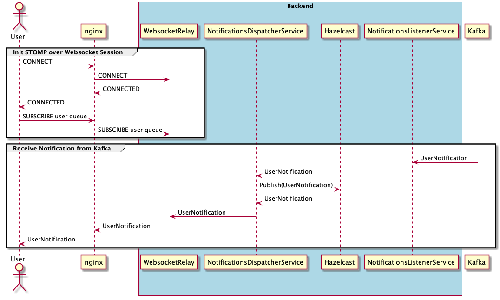

# Example: How to scale round robin streaming applications 

## Use Case

A User receives messages through a website in real-time (Push instead of Pull). Examples: Chats, Stock Exchange, Notifications.

## Given


  
* A **user** browsing a website
* A non-user aware **gateway** that equally distributes user requests to a backend API (round robin).
* A **backend API** that is subscribed to event topics on **message broker** can be scaled out dynamically. 
* A non-user aware **message broker** that equally publishes messages to topics (round robin).  

## Challenge

In this publish subscribe scenario the challenge is to router the messages for the user to those backend nodes holding an open connection. 

## Solution: Shared state via Hazelcast



### Prerequisites

* Docker
* Docker Compose
* Gradle

### Build

```bash
cd websocket-backend
./gradlew build bootJar && docker build --tag websocket-backend .
cd ..
```

### Run
````bash
docker-compose up --scale backend=3
````

